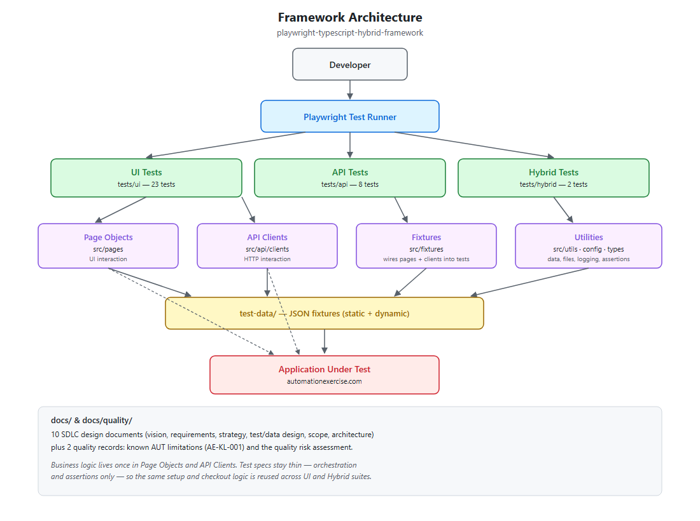
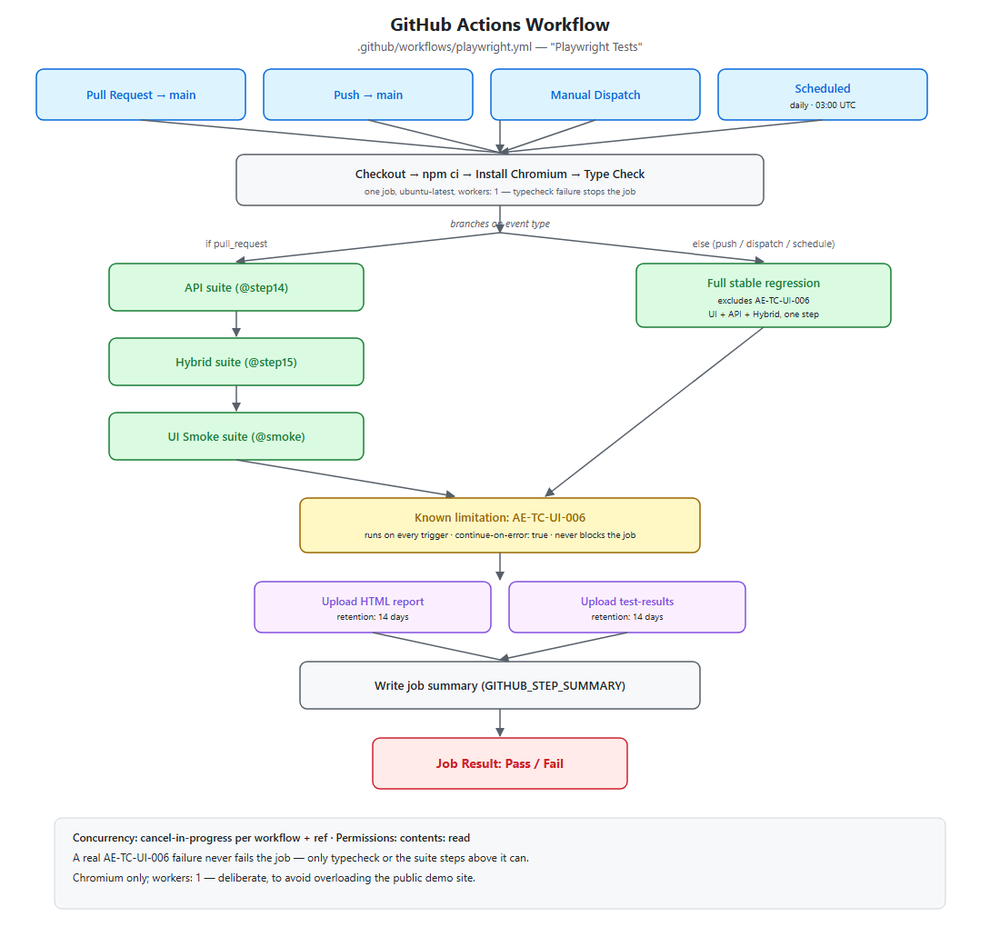
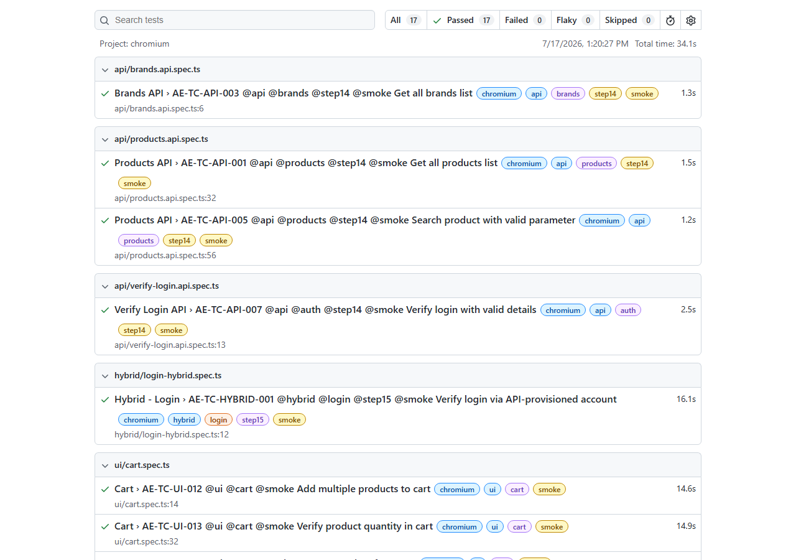

# Playwright TypeScript Hybrid Automation Framework

Documented first. Delivered in reviewed stages. Honest about the one thing it doesn't know yet.


---

## At a Glance

| Tests | Layers | CI | Docker | Known Limitations |
|---|---|---|---|---|
| 33 | UI · API · Hybrid | 4 triggers | Validated locally | 1 documented, 0 hidden |

---

## What This Is

A Playwright + TypeScript framework automating [automationexercise.com](https://automationexercise.com) across three layers — UI, API, and Hybrid (API-driven setup, UI-driven validation) — with GitHub Actions CI, Docker execution, and a full pre-implementation design document set.

It exists to answer one question directly: **can this engineer be trusted to own quality on a real team?** Everything below is evidence for that, not a claim of it.

---

## Why It Was Built This Way

Most public automation repositories are built in one pass — write tests, make them pass, stop. This one wasn't.

It shipped as eight independently reviewed, git-tagged increments, each hardened before the next began:

| Tag | Milestone |
|---|---|
| `v1.0.0-batch1` | Initial UI automation |
| `v1.0.0-batch2` | UI regression, batch 2 |
| `v1.0.0-batch3` | UI regression, batch 3 (checkout/order) |
| `v1.0.0-api` | API automation |
| `v1.0.0-hybrid` | Hybrid (API + UI) automation |
| `v1.0.0-ci` | GitHub Actions CI |
| `v1.0.0-docker` | Docker execution |
| `v1.0.0-quality` | Known-limitation and risk documentation |

That's the same staged-rollout discipline a reviewed pull request chain uses, applied to building the suite itself.

---

## What Makes It Different

**1. Documentation came before code.**
Ten design documents — vision, requirements, test strategy, test case design, test data design, automation scope, framework architecture — were written and approved before the first test existed. [See the index →](#documentation)

**2. Hybrid testing has a stated reason to exist.**
The Hybrid suite uses API calls for account setup specifically where that removes a real dependency on the UI registration flow — not just where it's technically possible. It isn't used everywhere; using it everywhere would be automation for its own sake, not engineering judgment.

**3. The one known limitation is documented, not deleted.**

> [!NOTE]
> `AE-TC-UI-006` is affected by an application-level timing/rendering behavior on the public demo site — one this project doesn't control and can't fully explain from the outside. Instead of removing the test or letting it silently break the pipeline, it runs in its own isolated, non-blocking CI step: visible on every run, evidence preserved, root cause explicitly marked **not confirmed**. [Read the full record →](docs/quality/KNOWN_AUT_LIMITATIONS.md)

That's the difference between hiding a problem and managing one.

---

## Repository Snapshot

| Aspect | Detail |
|---|---|
| Language | TypeScript |
| Test Framework | Playwright Test |
| CI | GitHub Actions — PR gate, push, manual dispatch, daily schedule |
| Containerization | Docker, version-pinned, validated locally |
| Architecture | Page Object Model + API clients + Hybrid orchestration |
| Documentation | 10 design documents + 2 quality/risk records |
| Delivery | 8 incremental, git-tagged baselines |

---

## Engineering Capabilities

**Tech stack**

| Layer | Choice |
|---|---|
| Language | TypeScript |
| Test runner | Playwright Test |
| Runtime | Node.js (LTS) |
| API testing | Playwright `APIRequestContext` |
| CI/CD | GitHub Actions |
| Containerization | Docker (official Microsoft Playwright image) |
| Reporting | Playwright HTML Reporter |

**What this demonstrates**

- Test architecture across three layers, each with a distinct responsibility
- Page Object Model and API client design with real separation of concerns
- A Hybrid strategy chosen deliberately, not applied blanket-wide
- CI/CD pipeline design: trigger strategy, artifact retention, non-blocking handling of a known limitation
- Reproducible execution via a version-pinned Docker image
- Writing down what isn't confirmed, not just what passes
- Documentation discipline across a complete pre-implementation SDLC

---

## Show Me the Architecture



```
tests/            → orchestration + assertions only
  ui/  api/  hybrid/
src/
  pages/           → Page Object Model (UI interaction)
  api/clients/     → API clients (HTTP interaction)
  fixtures/        → wires pages/clients into tests
  utils/           → data generation, files, logging, assertions
  types/           → shared TypeScript interfaces
  config/          → environment and timeout config
test-data/         → JSON fixtures (static + dynamic)
docs/              → SDLC design documents
docs/quality/      → known limitations + risk assessment
```

Business logic — account setup, checkout, payment — lives once in page objects and API clients. Test specs stay thin: orchestration and assertions, nothing else. The page objects and API clients don't change based on which spec calls them.

---

## Show Me the Test Scope

| Layer | Tests | Representative Tags |
|---|---|---|
| UI | 23 | `@smoke` `@regression` `@batch2` `@batch3` |
| API | 8 | `@step14` `@smoke` `@regression` |
| Hybrid | 2 | `@step15` `@smoke` `@regression` |
| **Total** | **33** | |

Every test carries exactly one of `@smoke` or `@regression`, plus a module tag. `AE-TC-UI-006` is counted here and covered by the callout above — it isn't quietly excluded from the numbers.

---

## Show Me It Running

```bash
git clone https://github.com/SharifulIslamSabuj/playwright-typescript-hybrid-framework.git
cd playwright-typescript-hybrid-framework

npm ci
npx playwright install --with-deps chromium

npm run typecheck
npx playwright test --project=chromium --grep "@smoke"
npx playwright test --project=chromium --grep-invert "AE-TC-UI-006"   # full stable regression

npm run test:report
```

Scoped by layer:

```bash
npm run test:ui
npm run test:api
npm run test:hybrid
```

**Same suite, inside Docker:**

```bash
docker build -t playwright-hybrid-framework .
docker run --rm \
  -v "$(pwd)/playwright-report:/app/playwright-report" \
  -v "$(pwd)/test-results:/app/test-results" \
  playwright-hybrid-framework \
  npx playwright test --project=chromium --grep "@smoke"
```

Pinned to `mcr.microsoft.com/playwright:v1.61.1-noble` — the exact tag matching the installed `@playwright/test` version, so Docker matches local and CI exactly.

---

## Show Me the Pipeline



| Trigger | Runs |
|---|---|
| Pull request → `main` | API + Hybrid + UI Smoke — fast, targeted feedback |
| Push to `main` | Full stable regression (excludes the documented known limitation) |
| Manual dispatch | Full regression, on demand |
| Daily schedule | Full regression — an early-warning canary for the public site |

`AE-TC-UI-006` runs as its own non-blocking step on every trigger — never silently skipped. Artifacts (HTML report, traces, screenshots, videos on failure) upload on every run and retain for 14 days.

Two scope choices are deliberate, not oversights. Execution is sequential (`workers: 1`), to avoid overloading the public demo site and to keep dynamically generated test data collision-free. And it's Chromium-only in CI and Docker — Firefox and WebKit stay configured in `playwright.config.ts`, ready to enable when cross-browser coverage is actually required.

---

## Show Me the Report



Every run — local, Docker, or CI — produces a Playwright HTML report with per-step detail and automatic failure evidence. In CI it's an uploaded artifact, not something that only exists transiently on the runner.

---

## Documentation

**Planning**

| Document | Purpose |
|---|---|
| [Project Vision](docs/AE-PV-001_Project_Vision.docx) | Why this project exists |
| [Application Analysis](docs/AE-AA-001_Application_Analysis.docx) | Analysis of the AUT |
| [Requirement Analysis](docs/AE-RA-001_Requirement_Analysis.docx) | Functional requirements |
| [Master Test Plan](docs/AE-TP-001_Master_Test_Plan.docx) | Overall test planning |

**Design**

| Document | Purpose |
|---|---|
| [Test Strategy](docs/AE-TS-001_Test_Strategy.docx) | Approach and regression strategy |
| [Test Scenario Design](docs/AE-TSD-001_Test_Scenario_Design.docx) | Scenario-level design |
| [Test Case Design](docs/AE-TC-001_Test_Case_Design.docx) | Automation-ready test cases |
| [Test Data Design](docs/AE-TDD-001_Test_Data_Design.docx) | Test data strategy |
| [Automation Scope](docs/AE-AS-001_Automation_Scope.docx) | What's automated, and why |
| [Framework Architecture](docs/AE-FA-001_Framework_Architecture.docx) | Technical architecture |

**Quality**

| Document | Purpose |
|---|---|
| [Known AUT Limitations](docs/quality/KNOWN_AUT_LIMITATIONS.md) | `AE-KL-001` in full detail |
| [Quality Risk Assessment](docs/quality/QUALITY_RISK_ASSESSMENT.md) | Risk matrix, portfolio-readiness stance |

<details>
<summary>Folder structure</summary>

```
├── .github/workflows/     # CI
├── docs/                  # design documents
│   ├── images/            # architecture/CI/report screenshots
│   └── quality/           # known limitations, risk assessment
├── src/
│   ├── api/clients/  ├── config/  ├── fixtures/
│   ├── pages/        ├── types/   └── utils/
├── test-data/
├── tests/{ui,api,hybrid}/
├── Dockerfile  ├── .dockerignore  └── playwright.config.ts
```

</details>

---

## Who Built This

**Md. Shariful Islam** — [@SharifulIslamSabuj](https://github.com/SharifulIslamSabuj)
QA Automation Engineer / SDET — Playwright, TypeScript, API and CI/CD test automation.

📧 shariful.islam5417@gmail.com
🔗 [LinkedIn](https://www.linkedin.com/in/sharifulislam-sqa/)

---

## License

ISC License — see [`LICENSE`](LICENSE).
